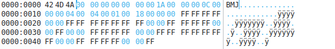
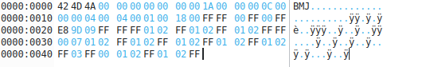
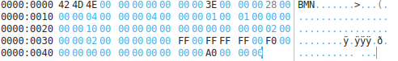
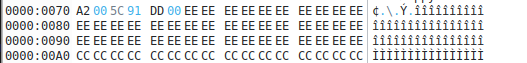
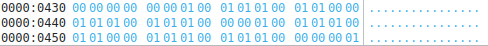
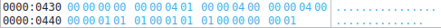
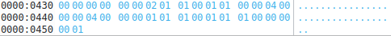
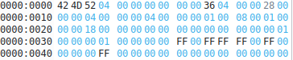
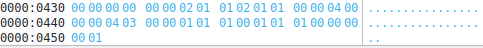
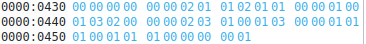

# Sae Images

## Partie A

### A.0) 
Il faut modifiez la taille du fichier dans okteta: 99 passe a 9A

### A.1)
{width=360px} 

### A.2)
{width=360px} 

### A.3) 
le poid de l'image augmente a 102 (74+28=102)
**1)** Toujours 24 bits par pixels -> car encore codée a 0x18
**2)** 0x30 donc 48 octets
**3)** Il n'y a pas de compression
**4)** Le codage des pixels n'a pas changé

### A.4)
**1)**  1bits par pixel
**2)**  0x10 donc 16 pixels
**3)**  Oui il y'a une compression utilisé
**4)**  Elles sont codée juste apres l'entete du fichiers, sur 4 octets
**5)**  Il y'a deux couleurs dans la palette, le rouge est blanc qui se situe au début -> 0x00 0x00 0xFF et 0xFF 0xFF 0xFF
**6)**  Oui le codage des pixels a changé, maintenant on code un quartet pour une ligne, chaque bits du quartet corresponds a un pixel, on remplace donc chaque bits pas 0 pour le rouge et 1 pour le blanc.
Donc pour notre cas on a :

*B.R.B.R -> 1010 -> A* 
*R.B.R.B -> *0101 -> 5*
*B.R.B.R -> *1010 -> A*
*R.B.R.B -> *0101 -> 5*

**7)**  Pour changer la couleur rouge en couleur bleue, il faut modifié dans les paramètre de la palette le rouge 0x00 0x00 0xFF 0x00 en bleue 0xFF 0x00 0x00 0x00
**8)**  Pour inversez le damier j'ai échanger la place des couleurs bleu et blanche dans les parametre de la palette, j'ai d'abord mis le blanc puis le bleue
**9)** On Fait le codage ligne par ligne
donc comme au dessus:
*1010 -> R.B.R.B -> A*
*0000 -> R.R.R.R -> 0*
*0000 -> R.R.R.R -> 0*
*1111 -> B.B.B.B -> F*
et code du bas vers le haut

**11)**  a l'adresse 0x2E ici 0x10 soit 16
**12)**  la 13 couleurs est le blanc dominant C pour l'utiliser, elle est codé par 0xFE 0xFE 0xFD
**13)**  Le tableau commence en 0x76, cette informations nous est donnée a l'adresse 0x0A
**14)**  On cherche d'abord dans la palette le bleu que l'on veut, ici c'est la 15e couleur donc E j'ai donc remplacé le début du fichier qui était remplie avec des C par des E
 
**15)** Cela diminue la qualité de l'image car moins de couleurs disponnible,
seulement 4 couleurs disponnible.

### A.5)
**2)** inversion 4 en -4 en complement a 2
0x04 0x00 0x00 0x00 en 0xFC 0xFF 0xFF 0xFF
0100 0000 0000 0000 0000 0000 0000 0000 en 1111 1100 1111 1111 1111 1111 1111 1111

**3)**  inversion 425 en -425 en complement a 2
inversion de 0xA9 0x01 0x00 0x00 en 0x57 0xFE 0xFF 0xFF 
1010 1001 0000 0001 0000 0000 0000 0000 en 0101 0111 1111 1110 1111 1111 1111 1111

### A.6) 
**1)**  poid de 0x60 0x04 0x00 0x00 donc 1120 octets
il a augmenté car on est passer a une palette de 256 couleurs (0x00 0x01 0x00 0x00) et qu'on code maintenant chaque pixels sur 8 bits
**2)**  on peut trouver a 0xA0  codé sur 4 octet l'adresse de début ( ici 0x36 0x04 0x00 0x00)
**3)**  
on lit les octets deux par deux, le premier est le nombre d'occurence de la couleurs qui est définit dans le deuxieme octet
0x00 représente le blanc et 0x01 représente le rouge
donc si on a 0x01 0x00 on aura un pixels rouge et si on a 0x01 0x01 on aura un pixel blanc
on peut imaginer que si il y'aurai eu 0x03 0x01 il y aurait eu 3 pixels blanc d'affilé
ensuite quand dans le premier octet il y'a 0 occurence de couleurs donc 0x00 et dans le second 0x00 aussi alors c'est une fin de ligne, par contre si dans le premier il y'a encore 0x00 et dans le second 0x01 alors c'est une fin de bitmap donc fin d'image
donc si on lit notre image ci-dessus on a :
0x01 0x00 0x01 0x01 0x01 0x00 0x01 0x01 0x00 0x00 - 1 rouge, 1 blanc, 1 rouge, 1 blanc, fin de ligne
0x01 0x01 0x01 0x00 0x01 0x01 0x01 0x00 0x00 0x00 0x01 0x00 0x01 0x01 0x01 0x00 - 1 blanc, 1 rouge, 1 blanc , 1 rouge, fin de ligne, 1 rouge, 1 blanc, 1 rouge
0x01 0x01 0x00 0x00 0x01 0x01 0x01 0x00 0x01 0x01 0x01 0x00 0x00 0x00 0x00 0x01 - 1 blanc, fin de ligne, 1 blanc, 1 rouge, 1 blanc,1 rouge, fin de ligne, fin d'image

### A.7)
**1)**  le poid de l'image est 1102 octets
le poid est moins grand que précedemment car dans cette image il y'a des suite de pixels qui ont la meme couleurs, donc la compression en RLE prend tout son sens car elle permet de coder ça plus facilement 
**2)**  
0x04 0x01 0x00 0x00 0x04 0x00 0x00 0x00 0x04 0x00 - 4 blanc, fin de ligne, 4 rouge, fin de ligne, 4 rouge
0x00 0x00 0x01 0x01 0x01 0x00 0x01 0x01 0x01 0x00 0x00 0x00 0x00 0x01 - fin de ligne, 1 blanc, 1 rouge, 1 blanc, 1 rouge, fin de ligne, fin d'image

### A.8)
j'ai modifié la premiere ligne afin d'obtenir 2 blanc, 1 rouge, 1 blanc donc 
je suis passer de 0x04 0x01 0x00 0x00 a 0x02 0x01 0x01 0x00 0x01 0x01 0x00 0x00
j'ai donc rajouté 4 octets donc je suis aller modifier la taille du fichier de 0x4E 0x04 0x00 0x00 a 0x52 0x04 0x00 0x00
  

### A.9)

J'ai d'abord rajouter le bleu et vert dans ma palette de couleurs donc 0xFF 0x00 0x00 0x00 et 0x00 0xFF 0x00 0x00 qui seront donc la couleurs 0x02 et 0x03

J'ai ensuite modifier les valeurs héxadecimal de l'image pour que les pixels ait la bonne couleurs
La taille n'a pas changé

### A.10)

Pour réduire le nombre de couleurs on change le nombre de couleurs de la palette de 256 a 4 donc : 
0x00 0x01 0x00 0x00 a 0x04 0x00 0x00 0x00
ensuite on peut enlever tout les 0x00 0x00 0x00 0x00 qui correspondait aux couleurs noirs de la palette de 256 couleurs, enfin il nous reste a changer la taille du fichier en fonction du nouveau poids du fichier donc ici 106 soit 0x6A et enfin mettre dans le header la nouvelle adresse où l'image commence donc 0x46 0x00 0x00 0x00

## Partie B

### B.1)

### B.2)

### B.3)

### B.4)

### B.5)

